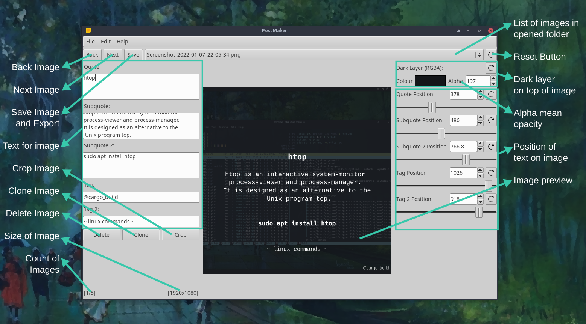

# Post Maker

    

> Post Maker helps you to make post for instagram and other social madia apps easily

## Compiling

### Build Dependencies

* Rust Compiler
* Cargo

### Installing rust

You can follow rust official guide to install rust compiler and cargo [Here](https://www.rust-lang.org/tools/install).

### Compiling

* Clone the Post Maker
* Open terminal inside the post_maker directory
* Run `cargo build --release`
* Copy `/post_maker/target/release/post_maker` to where ever you keep you binaries

Note: If you are using linux its always a good idea to keep binaries in `~/.local/bin` and add `~/.local/bin` in you [$PATH](https://www.redhat.com/sysadmin/linux-environment-variableshttps:/)

## General Overview of Controls

## License

This project is under [GPLv3](LICENSE)
