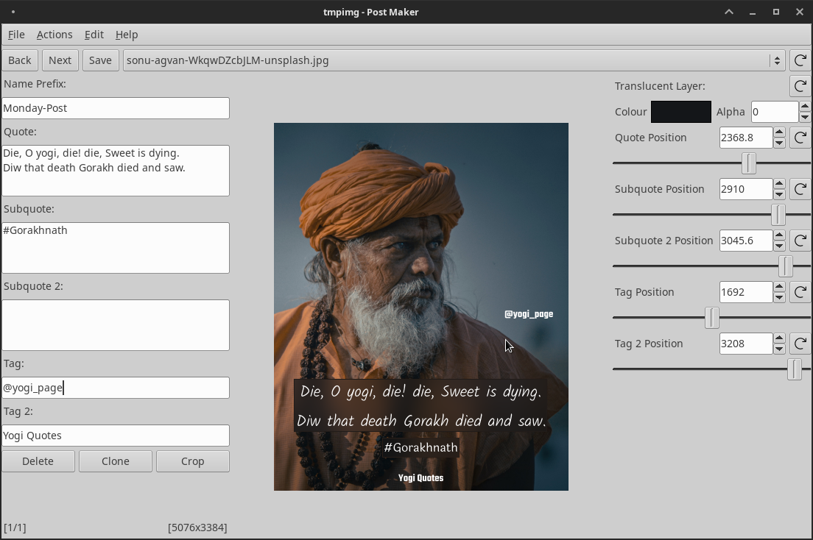

# Post Maker

    

> Post Maker helps you to make post for instagram and other social media apps easily and in massive amount. 

## Installing

### Windows

There are two ways to get Post Maker for windows.

* You can download a stable version from release
* You can build it yourself from git or released source

### Linux

We recommend you to build it yourself.

## Building

### Build Dependencies

* Rust Compiler
* Cargo

### Installing Rust

You can follow rust's official guide to install rust compiler and cargo [here](https://www.rust-lang.org/tools/install).

### Compiling

* Clone the post_maker repository `git clone https://github.com/PiyushXCoder/post_maker.git`
* Open terminal inside the post_maker directory
* Run `cargo build --release`
* Copy `/post_maker/target/release/post_maker` to where ever you keep your binaries

**Note:** If you are on linux, it is always a good idea to keep your binaries in `~/.local/bin` and add `~/.local/bin` to your [$PATH](https://www.redhat.com/sysadmin/linux-environment-variableshttps:/).

## General Overview of Controls

## License

This project is under [GPLv3](LICENSE)
